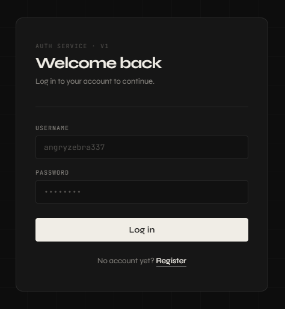
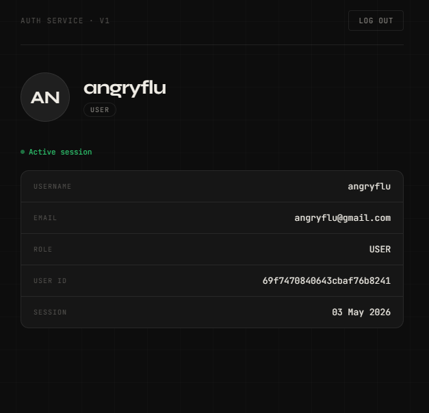

# Auth Service

Using <link src="">FreeAPI's </link>authentication module, i have tried to implement authentication service using react components fro login card, register card and profile page. This project allows user to register, login, access profile page and logout.

---
<div style="display: flex; flex-direction: row; gap:10px;">
  
  
</div>

## Project Structure

```
src/
├── auth/
│   ├── Register.jsx      — registration form
│   ├── Login.jsx         — login form
│   └── Profile.jsx       — user profile page
├── hooks/
│   └── useAuthForm.js    — shared form state, validation, and submission logic
├── App.jsx               — top-level router
└── auth.css              — all styles (dark industrial theme)
```

---